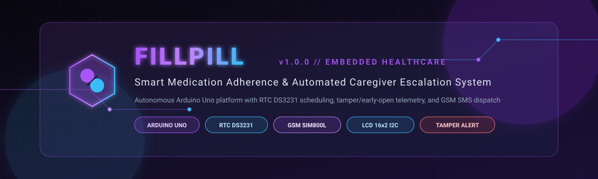
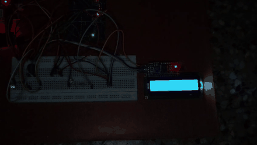
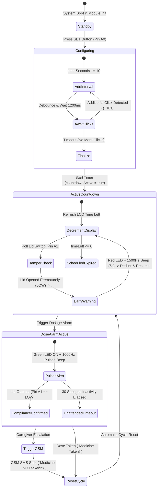

<div align="center">

  

  <br/>
  <br/>

  # 💊 FillPill – Smart Medication Reminder System

  **An autonomous embedded healthcare adherence platform engineered on Arduino Uno, featuring RTC DS3231 scheduling, compartment tamper detection, dual-stage audiovisual alerts, and GSM caregiver SMS escalation.**

  <br/>

  [](https://github.com/S-G-Rathenesh/FillPill)
  [](https://www.arduino.cc/)
  [](https://isocpp.org/)
  [](https://www.maximintegrated.com/)
  [](https://simcom.ee/)
  [](LICENSE)

  <br/>

  <p align="center">
    <a href="#-project-demonstration"><strong>Explore Demo</strong></a> •
    <a href="#-about-the-project"><strong>About FillPill</strong></a> •
    <a href="#-key-features"><strong>Key Features</strong></a> •
    <a href="#-how-it-works"><strong>How It Works</strong></a> •
    <a href="#-hardware-and-pin-connections"><strong>Hardware & Pinout</strong></a> •
    <a href="#-system-architecture"><strong>Architecture</strong></a> •
    <a href="#-software--firmware"><strong>Software</strong></a> •
    <a href="#-installation--setup"><strong>Setup Guide</strong></a> •
    <a href="#-functional-testing--verification"><strong>Testing</strong></a>
  </p>

</div>

---

## 🎥 Project Demonstration

<div align="center">
  
  
  <p align="center">
    <em>Real-time hardware bench test showcasing timer setup (+10s intervals), live LCD countdown, early-opening tamper warning (Red LED + continuous 1500 Hz siren), scheduled dosage alert (Green LED + pulsed chime), lid-switch acknowledgment, and automatic GSM SMS escalation.</em>
  </p>

  <br/>

  <a href="./VID-20251216-WA0034.mp4">
    
  </a>
</div>

> [!NOTE]
> The full 75-second uncompressed demonstration video is preserved directly in the repository as [`VID-20251216-WA0034.mp4`](./VID-20251216-WA0034.mp4) (15.05 MB). For bandwidth efficiency on web and mobile clients, an optimized 2.78 MB animated preview is rendered above.

---

## 📌 About the Project

### The Medication Adherence Problem
According to global health studies, more than **50% of patients with chronic illnesses fail to adhere strictly to prescribed medication regimens**. Non-adherence leads to severe clinical complications, preventable hospital readmissions, and substantial emotional strain on families and caregivers. Elderly patients, individuals managing polypharmacy, and individuals suffering from memory impairments are particularly prone to:
- **Skipping scheduled doses** due to distraction or cognitive fatigue.
- **Accidental double-dosing**, mistaking whether pills have already been consumed.
- **Prematurely opening compartments** without tracking remaining intervals.

### Why Standalone Embedded Hardware?
While smartphone apps exist, they frequently fail vulnerable demographics due to **complex touch interfaces, operating system notification fatigue, uncharged battery dependencies, and lack of reliable home Wi-Fi**.

**FillPill** bridges this gap through a **dedicated, physical, offline-first embedded device**. Powered by an **Arduino Uno microcontroller**, an **I2C Real-Time Clock (DS3231)**, and a **SIM800L GSM cellular transceiver**, FillPill acts as an autonomous healthcare appliance that keeps precise time, enforces dosage compliance, warns against early tampering, and directly summons remote caregiver assistance over cellular SMS when a dose is missed.

### Target Demographics
- 👵 **Elderly individuals** requiring clear, high-contrast, tactile reminders.
- 💊 **Patients on strict time-critical regimens** (antibiotics, cardiovascular therapies, immunosuppressants).
- 🏥 **Outpatient & post-surgery recovery patients** needing standalone dosage discipline.
- 👨‍👩‍👧 **Caregivers & family members** seeking immediate cellular SMS reassurance without relying on third-party mobile apps.

---

## ⚡ Key Features

All features documented below reflect the **actual firmware implementation in [`FillPill.ino`](file:///d:/Projects/Project%20Unzip/FillPill/FillPill.ino)** and the demonstrated hardware prototype:

* ⏱️ **Multi-Click Intuitive Timer Configuration**  
  Patients or caregivers can configure dosage countdowns effortlessly using a single tactile button on Pin `A0`. Each single press increments the scheduled timer by **10 seconds** (`timerSeconds += 10`). A 1.2-second debounce and inactivity window automatically locks the target time and triggers the countdown.

* 📟 **Real-Time LCD Telemetry (I2C 16×2)**  
  Clear, high-contrast visual status displays the system mode at all times, including boot banners (`FILLPILL READY`), configuration instructions (`Set the timer.. / 1 click = 10 sec`), active remaining time (`Time Left: X sec`), dosage alarms (`TIME TO TAKE MEDICINE!`), and dispatch status (`Sending SMS... / Not Taken!`).

* 🚨 **Tamper & Early Compartment Opening Warning**  
  If the medication compartment is opened while a countdown is still active (`lidButton == LOW`), the system intercepts the unscheduled access immediately:
  - Illuminates the **Red Warning LED** (Pin 11).
  - Triggers a piercing **1500 Hz buzzer tone for 5 seconds**.
  - Prompts `EARLY OPEN! / Wait 5 sec` on the LCD.
  - Safely recalculates remaining elapsed time and resumes the countdown without losing schedule integrity.

* 🔔 **Scheduled Dose Audiovisual Alert**  
  When the countdown hits zero, the device enters active alert mode:
  - Turns on the **Green LED** (Pin 10).
  - Emits a rhythmic, pulsed audible chime (**1000 Hz tone, 200 ms ON / 200 ms OFF**).
  - Displays `TIME TO TAKE / MEDICINE!` on the LCD.

* 📥 **Compartment Interaction & Automatic Cycle Reset**  
  Opening the lid during an active alarm acknowledges medication retrieval (`Medicine Taken!`). The firmware halts the buzzer, extinguishes the Green LED, and automatically restarts the cycle for the next scheduled interval (`restartTimer()`).

* 📡 **Autonomous Cellular SMS Caregiver Escalation**  
  If a dose is left unattended for **30 seconds** after the alarm begins, FillPill autonomously commands an onboard **SIM800L GSM transceiver** via AT commands (`AT+CMGF=1`, `AT+CMGS`) to transmit an urgent SMS notification (`Medicine NOT taken!`) directly to the caregiver's mobile telephone.

* 🔋 **Offline & Standalone Operation**  
  FillPill executes all scheduling and telemetry locally on the ATmega328P. It requires no Wi-Fi credentials, no Bluetooth pairing, and no cloud servers, ensuring mission-critical reliability even during home broadband outages.

---

## 🔄 How It Works

```
   ┌─────────────────────────────────────────────────────────────┐
   │                     1. System Bootup                        │
   │  Wire.begin() → rtc.begin() → gsm.begin(9600) → LCD init    │
   └──────────────────────────────┬──────────────────────────────┘
                                  │
                                  ▼
   ┌─────────────────────────────────────────────────────────────┐
   │                2. Multi-Click Schedule Set                  │
   │   User presses SET button (A0) in +10 sec increments        │
   │   LCD confirms duration; 1.2s inactivity locks timer        │
   └──────────────────────────────┬──────────────────────────────┘
                                  │
                                  ▼
   ┌─────────────────────────────────────────────────────────────┐
   │                    3. Live Countdown Loop                   │
   │   LCD renders remaining seconds (timeLeft = remain - delta) │
   └───────┬─────────────────────────────────────────────┬───────┘
           │                                             │
      [Lid Opened Early]                          [Timer Hits 0]
           │                                             │
           ▼                                             ▼
┌─────────────────────────────┐           ┌─────────────────────────────┐
│  Early Opening Intercept    │           │     Medication Alarm        │
│  - Red LED = HIGH           │           │  - Green LED = HIGH         │
│  - Buzzer = 1500 Hz (5 sec) │           │  - Buzzer = 1000 Hz Pulsed  │
│  - LCD: "EARLY OPEN!"       │           │  - LCD: "TIME TO TAKE!"     │
│  - Resume remaining time    │           └──────────────┬──────────────┘
└─────────────────────────────┘                          │
                                           ┌─────────────┴─────────────┐
                                           │                           │
                                     [Lid Opened]             [30s Timeout Unattended]
                                           │                           │
                                           ▼                           ▼
                            ┌────────────────────────┐  ┌────────────────────────┐
                            │   Normal Compliance    │  │ Caregiver Escalation   │
                            │  - LCD: "Taken!"       │  │  - AT+CMGS GSM SMS     │
                            │  - Stop Alarm / LEDs   │  │  - "Medicine NOT taken"│
                            │  - Restart Next Cycle  │  │  - LCD: "SMS SENT!"    │
                            └────────────────────────┘  └───────────┬────────────┘
                                           ▲                        │
                                           └────────────────────────┘
```

### Operational State Machine (Mermaid)



---

## 🏗️ System Architecture

The following diagram illustrates the hardware interconnects, signal pathways, and data buses linking the microcontroller, sensors, timekeeping units, cellular radio, and user interfaces:

```mermaid
graph TD
    subgraph Power ["⚡ Power Distribution"]
        PWR_DC["5V DC / USB Supply<br/>Arduino Power"]
        PWR_BATT["3.7V - 4.2V Li-ion (2A Peak)<br/>Dedicated GSM Supply"]
    end

    subgraph Inputs ["🎛️ Input Sensors & Controls"]
        BTN_SET["Set Button (A0)<br/>Tactile Pushbutton (INPUT_PULLUP)"]
        SW_LID["Lid Sensor (A1)<br/>Contact / Reed Switch (INPUT_PULLUP)"]
        RTC_MOD["DS3231 RTC Module<br/>Battery-Backed I2C Clock"]
    end

    subgraph Controller ["🧠 Microcontroller Core"]
        UNO["Arduino Uno Board<br/>ATmega328P (16 MHz)"]
    end

    subgraph Outputs ["📢 Actuators & Telemetry"]
        LCD_DSP["16x2 LCD Display<br/>I2C PCF8574 Backpack (0x27)"]
        LED_GRN["Green LED (Pin 10)<br/>Dose Reminder Visual"]
        LED_RED["Red LED (Pin 11)<br/>Early Tamper Warning Visual"]
        BUZZER["Piezo Buzzer (Pin 9)<br/>PWM Tone Generator"]
        GSM_MOD["SIM800L GSM Modem<br/>SoftSerial (RX: 7, TX: 8)"]
    end

    subgraph External ["📱 Telecommunications"]
        CARE_PHONE["Caregiver Mobile Phone<br/>Emergency SMS Recipient"]
    end

    PWR_DC --> UNO
    PWR_BATT --> GSM_MOD

    BTN_SET -->|Analog A0 / Digital Read| UNO
    SW_LID -->|Analog A1 / Digital Read| UNO
    RTC_MOD <-->|I2C SDA (A4) / SCL (A5)| UNO

    UNO -->|I2C SDA (A4) / SCL (A5)| LCD_DSP
    UNO -->|Digital Pin 10 (Current Limit R)| LED_GRN
    UNO -->|Digital Pin 11 (Current Limit R)| LED_RED
    UNO -->|Digital Pin 9 (PWM / Tone)| BUZZER
    UNO <-->|SoftwareSerial UART (Pin 7 / 8)| GSM_MOD

    GSM_MOD -.->|2G Cellular Network| CARE_PHONE

    classDef mcu fill:#1F1338,stroke:#A855F7,stroke-width:2px,color:#FFFFFF;
    classDef io fill:#111827,stroke:#38BDF8,stroke-width:1.5px,color:#E2E8F0;
    classDef alert fill:#2E1018,stroke:#F43F5E,stroke-width:1.5px,color:#FECDD3;
    classDef ok fill:#062817,stroke:#10B981,stroke-width:1.5px,color:#D1FAE5;
    classDef comm fill:#261805,stroke:#F59E0B,stroke-width:1.5px,color:#FEF3C7;

    class UNO mcu;
    class BTN_SET,SW_LID,RTC_MOD,LCD_DSP io;
    class LED_RED,BUZZER alert;
    class LED_GRN ok;
    class GSM_MOD,CARE_PHONE comm;
```

---

## 🔌 Hardware and Pin Connections

The table below reflects the exact hardware pin configuration declared in [`FillPill.ino`](file:///d:/Projects/Project%20Unzip/FillPill/FillPill.ino):

| Component | Module Pin | Arduino Uno Pin | Mode / Configuration | Technical Function |
|:---|:---|:---|:---|:---|
| **Set Pushbutton** | Terminal 1<br/>Terminal 2 | **A0**<br/>GND | `INPUT_PULLUP` | Configures schedule; each depression adds +10s to countdown. |
| **Lid / Compartment Switch** | Terminal 1<br/>Terminal 2 | **A1**<br/>GND | `INPUT_PULLUP` | Detects compartment opening; active LOW (`digitalRead == LOW`). |
| **Buzzer** | Anode (+)<br/>Cathode (-) | **Pin 9**<br/>GND | `OUTPUT` | Multi-tone acoustic alerts: 1500 Hz continuous / 1000 Hz pulsed. |
| **Green LED** | Anode (+)<br/>Cathode (-) | **Pin 10**<br/>GND | `OUTPUT` via 220Ω resistor | Visual indication for active medication dosage window. |
| **Red LED** | Anode (+)<br/>Cathode (-) | **Pin 11**<br/>GND | `OUTPUT` via 220Ω resistor | Visual warning for unauthorized or early compartment opening. |
| **SIM800L GSM Module** | TXD<br/>RXD<br/>VCC / GND | **Pin 7** (Arduino RX)<br/>**Pin 8** (Arduino TX)<br/>External 3.7V - 4.2V (2A) | `SoftwareSerial(7, 8)`<br/>Baud: 9600 bps | Transmits automated SMS alerts when medication is unattended. |
| **16×2 LCD Display** | SDA<br/>SCL<br/>VCC / GND | **Pin A4** (SDA)<br/>**Pin A5** (SCL)<br/>5V / GND | I2C Protocol<br/>Address `0x27` | Renders user instructions, real-time countdown, and alerts. |
| **DS3231 RTC Module** | SDA<br/>SCL<br/>VCC / GND | **Pin A4** (SDA)<br/>**Pin A5** (SCL)<br/>5V / GND | I2C Protocol<br/>Shared with LCD | Provides battery-backed real-time clock synchronization. |

---

## 🛠️ Bill of Materials (BOM)

| Component Name | Quantity | Specifications / Form Factor | Role in System |
|:---|:---:|:---|:---|
| **Arduino Uno R3** | 1 | Microchip ATmega328P, 16 MHz, 32 KB Flash | Core central processing and logic controller |
| **DS3231 RTC Board** | 1 | Temperature-compensated crystal oscillator (TCXO), CR2032 backup | Accurate embedded real-time timekeeping |
| **16×2 Character LCD** | 1 | HD44780 with PCF8574 I2C daughterboard (Addr `0x27`) | Primary visual user telemetry and status terminal |
| **SIM800L GSM Module** | 1 | Quad-Band 850/900/1800/1900MHz, micro-SIM socket | Cellular communication engine for remote SMS alerts |
| **Active/Passive Piezo Buzzer** | 1 | 5V DC, SPL ≥ 85 dB | Audible multi-frequency acoustic alarm generator |
| **Tactile Pushbuttons** | 2 | 6×6 mm momentary tactile switches (Set & Lid) | User configuration button & compartment lid contact |
| **5mm Green LED** | 1 | Standard diffused, ~2.1V forward voltage | Medicine due visual indicator |
| **5mm Red LED** | 1 | Standard diffused, ~1.9V forward voltage | Early tamper / warning indicator |
| **Resistors** | 2 | 220 Ω / 330 Ω, 0.25W carbon film | Current-limiting protection for indicator LEDs |
| **Breadboard & Jumpers** | 1 set | Half-size solderless breadboard + male-to-male wires | Circuit prototyping and component interconnection |

---

## 💻 Software & Firmware Implementation

The firmware is implemented in Arduino C/C++ inside [`FillPill.ino`](file:///d:/Projects/Project%20Unzip/FillPill/FillPill.ino). It is architected for deterministic real-time behavior without blocking system responsiveness:

### Key Software Libraries
```cpp
#include <Wire.h>               // Arduino I2C communication bus
#include <LiquidCrystal_I2C.h>  // I2C 16x2 Character Display driver
#include <SoftwareSerial.h>     // Bit-banged UART serial for GSM modem
#include <RTClib.h>             // DS3231 Real-Time Clock register interface
```

### Core Program Routines
- **`setup()`**: Initializes I2C (`Wire.begin()`), checks RTC presence (`rtc.begin()`), opens GSM serial at 9600 baud (`gsm.begin(9600)`), configures pin modes with internal pull-up resistors for inputs, primes the LCD backlight, and displays initial prompts.
- **`loop()`**: Operates across three mutually exclusive operational phases:
  1. **Timer Configuration Phase**: Monitors Pin `A0` multi-clicks. Every click adds 10 seconds to `timerSeconds`. Waits up to 1.2 seconds for subsequent clicks before initiating countdown.
  2. **Active Countdown Phase**: Computes elapsed seconds via `millis()`. Simultaneously samples Pin `A1` (lid button). If pressed prematurely, interrupts countdown with a 5-second 1500 Hz tone, flashes the Red LED, displays `EARLY OPEN!`, and seamlessly restores remaining time upon resumption.
  3. **Alarm Phase**: Triggers when time reaches zero. Illuminates Green LED and pulses 1000 Hz audio. If acknowledged via Pin `A1`, displays `Medicine Taken!` and resets. If unattended for 30,000 ms (30 seconds), automatically invokes `sendSMS()`.
- **`sendSMS(String msg)`**: Formats GSM modem into SMS text mode (`AT+CMGF=1`), sets recipient address (`AT+CMGS="+91XXXXXXXXXX"`), pushes message payload, and transmits ASCII control byte `0x1A` (CTRL+Z) to dispatch cellular packet.
- **`stopAlarm()` & `restartTimer()`**: Safely clear actuator states, silence tone generators, and reload schedule variables for seamless cyclic monitoring.

---

## 🚀 Installation & Setup

### Prerequisites
1. **Arduino IDE** (v1.8.x or v2.x) downloaded from [arduino.cc](https://www.arduino.cc/en/software).
2. Install the required libraries via the **Arduino Library Manager** (`Sketch` ➔ `Include Library` ➔ `Manage Libraries...`):
   - `LiquidCrystal_I2C` by Frank de Brabander
   - `RTClib` by Adafruit
3. Standard USB Type-A to Type-B cable for Arduino Uno.
4. Activated 2G-compatible micro-SIM card inserted into the SIM800L module.

### Flashing Procedure
1. Clone this repository to your local workstation:
   ```bash
   git clone https://github.com/S-G-Rathenesh/FillPill.git
   cd FillPill
   ```
2. Open [`FillPill.ino`](file:///d:/Projects/Project%20Unzip/FillPill/FillPill.ino) in the Arduino IDE.
3. Configure the destination phone number for caregiver alerts on **line 233**:
   ```cpp
   gsm.println("AT+CMGS=\"+91XXXXXXXXXX\""); // Replace with your caregiver phone number
   ```
4. Verify your I2C address for the LCD display on **line 7** (default is `0x27`, some modules use `0x3F`):
   ```cpp
   LiquidCrystal_I2C lcd(0x27, 16, 2);
   ```
5. Select board: `Tools` ➔ `Board` ➔ `Arduino AVR Boards` ➔ **Arduino Uno**.
6. Select your active serial port under `Tools` ➔ `Port`.
7. Click **Upload** (or press `Ctrl + U`).

---

## 🧪 Functional Testing & Verification

The testing matrix below outlines the exact behavioral validation performed and confirmed on the physical FillPill hardware prototype:

| # | Verification Test Case | Stimulus / Trigger Condition | Observed Physical Behavior | Verification Status |
|:---:|:---|:---|:---|:---:|
| **1** | **System Initialization** | Microcontroller cold power-up | LCD displays `FILLPILL READY` for 1.5s, then prompts `Set the timer.. / 1 click = 10 sec`. | **Verified & Working** |
| **2** | **Timer Incrementation** | Single depression on Pin A0 | LCD updates to `Time Set: 10 sec`. Subsequent clicks within 1.2s increment by +10s sequentially. | **Verified & Working** |
| **3** | **Live Countdown** | Inactivity timeout (1.2s post-set) | System transitions to countdown; LCD refreshes live remaining duration (`Time Left: X sec`). | **Verified & Working** |
| **4** | **Early Opening Intercept** | Lid switch (Pin A1) pressed during countdown | Red LED lights up; continuous 1500 Hz buzzer sounds for 5s; LCD displays `EARLY OPEN! Wait 5 sec`. Countdown resumes safely with remaining duration. | **Verified & Working** |
| **5** | **Scheduled Dosage Alarm** | Countdown timer elapses to 0s | Green LED lights up; buzzer emits pulsed 1000 Hz chime (200ms ON / 200ms OFF); LCD displays `TIME TO TAKE MEDICINE!`. | **Verified & Working** |
| **6** | **Timely Compliance** | Lid switch (Pin A1) pressed during active alarm | Buzzer and Green LED immediately extinguish; LCD confirms `Medicine Taken!`; cycle restarts with previously set schedule. | **Verified & Working** |
| **7** | **Missed Dose Escalation** | Alarm remains unacknowledged for ≥ 30 seconds | System halts local alarm; LCD displays `Sending SMS... Not Taken!`; SIM800L sends `Medicine NOT taken!` SMS to remote caregiver. | **Verified & Working** |

---

## ⚠️ Limitations & Technical Boundaries

In compliance with rigorous engineering and academic standards, the following practical constraints of the current prototype are openly acknowledged:

- **Compartment Access vs. Physiological Ingestion**: The system detects physical access to the compartment (via contact switch/reed switch). It does **not** biochemically verify that medication was swallowed by the patient.
- **Physical Lock Absence**: The current prototype warns against early access via audiovisual alerts but does not incorporate a motorized or solenoid locking deadbolt to physically prevent access.
- **Single-Schedule Granularity**: The firmware currently manages a single recurring countdown timer set in 10-second multiples. Multi-compartment scheduling for multiple distinct medications across different hours of the day is a subject of future work.
- **Prototyping Status**: FillPill is an academic embedded engineering prototype and is **not certified as a regulated medical device** under FDA, CE-MDR, or ISO 13485 standards.

---

## 🔮 Future Enhancements

The following extensions are planned as future engineering iterations:

- 🔒 **Solenoid-Actuated Compartment Locking**: Integrating an electromechanical latch to physically restrict opening until the exact scheduled window.
- 📦 **Multi-Compartment Rotary Pill Carousel**: Implementing a stepper-driven multi-bin carousel to support distinct morning, noon, and evening pill regimes.
- ⚖️ **Weight / Optical Pill Presence Detection**: Adding micro-load-cells or optical break-beam sensors inside bins to verify actual pill extraction.
- 📱 **Bluetooth Low Energy (BLE) Companion App**: Facilitating smartphone schedule synchronization and medication logging via BLE without sacrificing offline autonomy.
- 🔋 **Li-Ion Battery Management & Sleep Modes**: Implementing ATmega328P `avr/sleep` low-power modes and dedicated USB-C TP4056 charging circuitry for multi-day portable battery life.

---

## 🎓 Academic & Engineering Context

FillPill was developed as an embedded systems engineering demonstration exploring how low-cost, off-the-shelf microcontrollers and standardized sensor interfaces can be synthesized into robust, offline-capable assistive healthcare technologies. It showcases:
- Real-time embedded state machine design in C/C++.
- Non-blocking timing management (`millis()` arithmetic).
- Shared I2C bus arbitration between display modules and real-time clock hardware.
- Bit-banged software UART serial communication with cellular modems.
- Sensor-driven tamper interception and safety fail-safes.

---

## 📁 Repository Structure

```
FillPill/
├── assets/
│   ├── banner.svg                # Cyberpunk-styled vector project header
│   └── fillpill-demo.gif         # 2.78 MB optimized hardware demonstration GIF
├── FillPill.ino                  # Complete Arduino Uno firmware source code
├── LICENSE                       # MIT License
├── README.md                     # Comprehensive project documentation
└── VID-20251216-WA0034.mp4       # Full uncompressed 75s hardware demo video (15.05 MB)
```

---

## 📄 License

This project is open-source and licensed under the terms of the **[MIT License](LICENSE)**.

```
MIT License
Copyright (c) 2026 Rathenesh S G
```

---

## 👤 Author & Acknowledgments

**Rathenesh S G**  
- GitHub: [@S-G-Rathenesh](https://github.com/S-G-Rathenesh)  
- Repository: [FillPill on GitHub](https://github.com/S-G-Rathenesh/FillPill)

*Developed with passion for embedded hardware, IoT healthcare solutions, and assistive engineering.*
